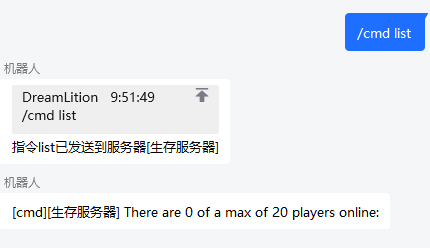
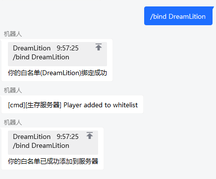
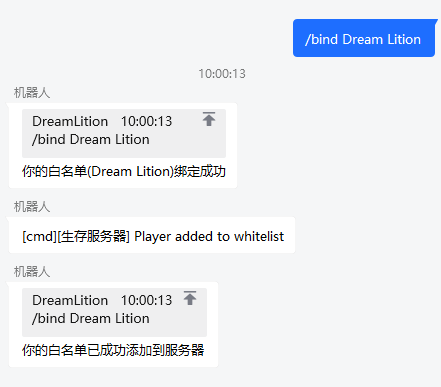
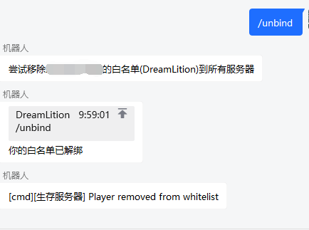

# 
命令

***

## 执行命令

在主群中发送`/cmd xxx`即可执行命令

***

## 查询服务器状态

在主群中发送`查服`

***

## 申请白名单

成员可以用`/bind xxxx`命令绑定自己的qq号与白名单，同时可以添加白名单到服务器

对于带有空格的xboxid，无需加双引号

## 注销白名单

成员可以用`/unbind`命令解绑定自己的白名单，同时自动从服务器移除白名单

