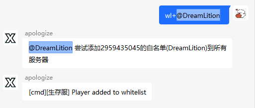
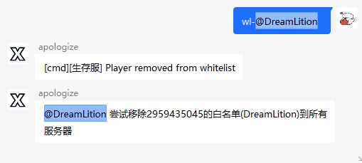

# <center>命令</center>

***

## ```wl+@xxx```

添加被At成员的白名单到所有服务器



📌 支持At多个人

***

## ```wl-@xxx```

从XBridge储存的白名单数据和所有服务器中移除玩家的白名单



📌支持At多个人

***

## ```/cmd```

执行命令


```/cmd <命令>``` - 只连接了一个服务器时，直接跟要发送的命令就可以

```/cmd <服务器名称> <命令>``` - 连接多个服务器时，需要在第二个参数填上服务器名字，从第三个参数开始是命令

***

## ```/bind xxxx```

绑定白名单


📌支持带有空格的xboxid，无需加引号


***

## ```/unbind```

解绑白名单

从所有服务器和XBridge白名单组件中移除发信者的白名单


