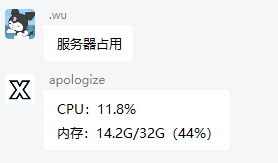

# <center>正则表达式</center>
***

使用正则表达式可以让您更方便，更直接的使用XBridgeR

例如可以查询服务器占用情况



更多用法等待您的探索

***

## 正则主体

XBridgeR的正则表达式文件是一条正则表达式链，内有多个正则成员

一个标准的正则成员应该包括`Regex`,`permission`和`out`

``` json
[
	{
		"Regex": "^服务器占用$",  //正则表达式主体
		"permission": 0, //执行权限，0为所有人，1为全局管理员
		"out": [
			{
				"type": "group",  //执行模式，即下文的TYPE
				"text": "CPU：%COMPUTER_CPU_PERCENT%%\n内存：%COMPUTER_RAM_USED%G/%COMPUTER_RAM_TOTAL%G（%COMPUTER_RAM_PERCENT%%）"
			}
		]
	}
]
```

***

## TYPE


| 执行模式 | 行为 | 注意 |
|:-:|:-:|:-:|
| runcmdall | 向所有服务器发送指令 | |
| textall | 向所有服务器的玩家发送信息 | |
|group|向群聊中发送讯息|默认向触发群聊发送|
|http_get|发起一个异步远程HTTPGET请求|text即为远程地址|

***

## XB_Placeholder

正则表达式可用的占位符

### <center>MEMBER类</center>

| 占位符 | 替换结果 | 注意 |
|:-:|:-:|:-:|
|%MEMBER_XBOXID%|发言者位于XBridge白名单所登记的xboxid|如果玩家没有登记记录则不会替换|
|%MEMBER_QQ_NICK%|发言者位于群聊中的名称||
|%MEMBER_QQ_ID%|发言者QQ号||

***

### <center>AT类</center>

| 占位符 | 替换结果 | 注意 |
|:-:|:-:|:-:|
|%AT_QQ_ID%|被@成员的QQ号|如果没有则不会替换|
|%AT_MEMBER_XBOXID%|被@成员的xboxid|如果没有记录则不会替换|

***

### <center>COMPUTER类</center>

| 占位符 | 替换结果 | 注意 |
|:-:|:-:|:-:|
|%COMPUTER_RAM_LESS%|计算机物理内存剩余量||
|%COMPUTER_RAM_TOTAL%|计算机物理内存总量||
|%COMPUTER_RAM_USED%|计算机物理内存使用量||
|%COMPUTER_RAM_PERCENT%|计算机物理内存使用百分比||
|%COMPUTER_CPU_PERCENT%|计算机CPU使用率百分比||
